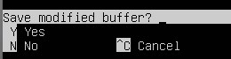
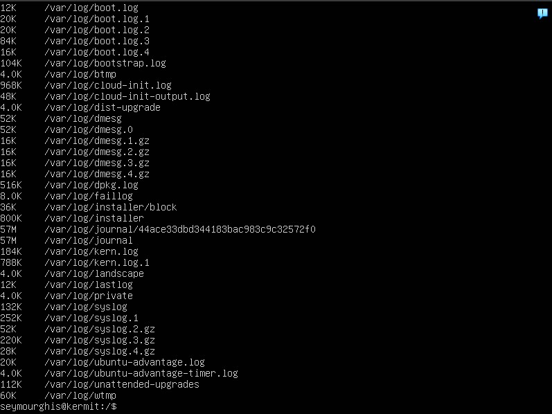
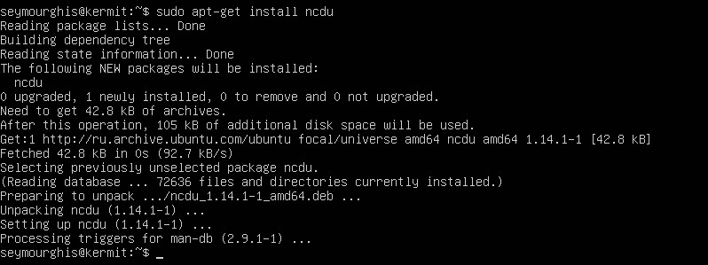
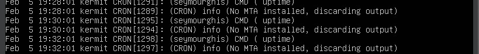

## Часть 1. Установка ОС

- Информация о версии ОС.

## Часть 2. Создание пользователя

- Вывод команды cat /etc/passwd  после добавления нового пользователя "runcelgh"(изначальный пользователь seymourghis)

## Часть 3. Настройка сети ОС

- Изменение hostname'а.

- Установка временной зоны.

- Список названий сетевых интерфейсов 

- Интерфейс **lo** - это локальная петля, которая имеет IP-адрес 127.0.0.1 и предназначена для сетевого доступа к своему же компьютеру

- Ip адрес текущего устройства

- **Dynamic Host Configuration Protocol (DHCP)** — протокол, позволяющий автоматически настраивать сетевые параметры компьютера, такие как IP-адрес, маска подсети, шлюз по умолчанию и DNS-серверы.

- Внешний адрес шлюза

- Внутренний адрес шлюза

- Заданные статично в конфигурационный файл ip gw и DNS(сам файл 00-installer-config.yaml был изменён через vim)

- После изменения конфигурации обязательно нужно выполнить команду netplan apply

- Пинг на 1.1.1.1 и ya.ru для проверки сети

## Часть 4. Обновление ОС

- sudo apt update - обновление системы

## Часть 5. Использование команды sudo

- Добавляем пользователя runcelgh в группу sudo выполняя: sudo usermod -G sudo runcelgh 
- С помощью команды sudo -i -U runcelgh проверяем может ли пользователь вызывать sudo

- sudo — это утилита, предоставляющая привилегии root для выполнения административных операций в соответствии со своими настройками. Она позволяет легко контролировать доступ к важным приложениям в системе. По умолчанию, при установке Ubuntu первому пользователю (тому, который создаётся во время установки) предоставляются полные права на использование sudo. Т.е. фактически первый пользователь обладает той же свободой действий, что и root.

## Часть 6. Установка и настройка службы времени

- Часовой пояс UTC+7

- Вывод timedatectl show

## Часть 7. Установка и использование текстовых редакторов

- VIM

- Для выхода с сохранением ":wq"

  

- Для выхода без сохранения "q!"

- Для поиска вниз используется "/word_to_find", вверх используется "?word_to_find"
- Также для поиска одного символа можно использовать "f"

- Для поиска и замены существует конструкция ":%s/word_to_change/new_word"

- Nano

- Для сохранения сочетание клавиш ctrl+o
- Для закрытия ctrl+x

- Для закрытия без сохранения изменений нужно просто закрыть редактор сочетанием из прошлого пункта и отказаться от сохранения нажав "n"

- Для поиска в нано используется сочетание клавиш ctrl+w после чего нужно ввести искомый текст и нажать enter(при этом что бы дальше листать совпадения можно использовать как повторное применение ctrl+w, enter так и alt+w)

- Для поиска и замены использовать ctrl+\(сначала запрашивает что искать, потом на что менять и проходится по всем совпадениям предлагая заменить, можно менять по одному а можно сразу все)

- JOE

- Для выхода - ctrl+k и затем q, редактор предложит сохранить изменения если они были таким образом для выхода с сохранением жмём y или n что бы отказаться от сохранения изменений

- Для поиска ввести ctrl+k затем f и искомый текст

- То же для поиска и замены только, при поиске выбрать пункт Replace и указать заменяемый текст

## Часть 8. Установка и базовая настройка сервиса SSHD

- sudo apt-get install ssh для установки sshd
- sudo systemctl enable ssh для включения автостарта и systemctl status ssh для проверки работы

- sudo nano /etc/ssh/sshd_config и замена port 22 на port 2022
- systemctl restart sshd - перезапуск службы для обновления порта

- ps утилита которая позволяет отображать процессы запущенные на машине, также здесь используется флаг -C который позволяет отобразить процессы по названию в нашем случае sshd

- Вывод netstat -tan

- netstat - утилита для вывода информации о сетевых подключениях, портах и процессах которые их используют
- флаг - a(all) отображает все подключенные и ожидаемые сокеты
- флаг -t(TCP) ограничивает отображение только до TCP сокетов
- флаг -n(numeric)показывает IPv4 адреса в точечно-десятичном формате

- proto - используемый протокол - в нашем случае TCP(*Transmission Control Protocol* — протокол управления передачей)
- recv-q - очередь приёма, то есть входящие байты которые были получены, буферизованы и ожидают локальной обработки процессом который использует это подключение
- send-q - очередь отправления. то есть байты ожидающие отправки
- local address - это данные об адресе локального конца соединения(в нашем случае 0.0.0.0 означает маршрут по умолчанию)
- foreign address - адрес и порт удалённого конца соединения 
- state - состояние локального сокета(LISTEN- этот сокет ожидает запроса на подключение)

## Часть 9. Установка и использование утилит top, htop

-  Утилиты уже были установлены в системе

### Top

- uptime - 7 min
- 2 пользователя

- общая нагрузка - 0.08 0.11 0.08
- общее кол-во процессов - 113
- загрузка ЦП:  0.2%
- загрузка памяти: 661.8/6139.7
- pid процесса занимающего больше всего памяти - 370(нажать M для сортировки по %MEM)

- pid процесса, занимающего больше всего процессорного времени - 1708(нажать P для сортировки по %CPU)

### Htop

- сортировка по PID командой htop --sort-key PID

- сортировка командой htop --sort-key PERCENT_CPU

- сортировка командой htop --sort-key PERCENT_MEM

- сортировка командой htop --sort-key TIME

- фильтрация по sshd через: f4 и ввод sshd

- фильтрация по sshd через: f3 и ввод syslog

- нажав f2 можно попасть в меню настройки утилиты где мы и добавим отображение hostname, clock, uptime

## Часть 10. Использование утилиты fdisk

- /dev/sda2 - размер 25 ГБ, 52422656 секторов, swap - 4 ГБ

## Часть 11. Использование утилиты df

- размер - 25623780
- занято - 7033884
- свободно - 17262948
- процент использования - 29 
- единица измерения 1 килобайт

#### Добавим флаги -Th

- размер - 25 Гб
- занято  - 6.8 Гб
- свободно - 17 Гб
- процент использования - 29
- тип файловой системы - ext4

## Часть 12. Использование утилиты du

- /home - 168 Кб

- /var - 722 Мб

- /var/log - 61 Мб

- sudo du -h /var/log/*

## Часть 13. Установки и использование утилиты ncdu

- установка

- ncdu ../../

- /home -164 KiB
- /var - 717.3 MiB
- /var/log - 60.8 MiB

## Часть 14. Работа с системными журналами

- sudo cat /var/log/dmesg
- sudo cat /var/log/syslog
- sudo cat /var/log/auth.log

- последний вход

- отчёт о рестарте 

## Часть 15. Использование планировщика заданий CRON

- логи исполнения uptime

- отображение отсутствия заданий CRON

